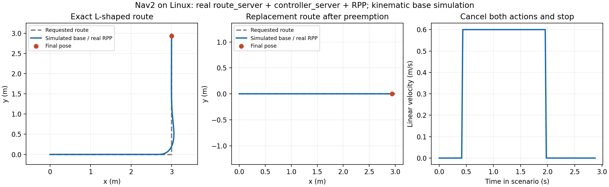

# TrackPrecomputedRoute validation report

PR: https://github.com/ros-navigation/navigation2/pull/6631

Tested implementation: `a6c6af5f55b2bd34e364fa74d20e7faf6cd77120`. Its last change aligns XML port representations; runtime code is the same as the locally built implementation. This report and its artifacts live on a separate branch of the contributor fork so they do not add generated logs or binary assets to the upstream PR.

## Build and regression checks

Environment: physical Linux x86_64 workstation, Ubuntu 26.04 container, ROS Rolling. Compiler warnings are treated as errors.

| Check | Result |
| --- | --- |
| Dependency and feature package build | 11 packages passed |
| Additional actual controller and RPP package build | 2 packages passed |
| nav2_route CTest targets | 25/25 passed |
| nav2_behavior_tree CTest targets | 87/87 passed |
| GTest cases in these two packages | 324 passed, 0 failed, 0 skipped |
| New GTest cases | 27 passed (11 resolver, 13 real action, 3 BT) |
| Uncrustify, cpplint, copyright, CMake and XML | Passed |
| Exact repository XML/code validation script | Passed after XML port alignment |
| Official BT XML generator loads the plugin | Passed |

New tests cover canonical metadata and operation preservation, directed/ambiguous/disconnected IDs, loops and repeated edges, single-node routes, feedback and paths, cancellation, preemption and correlation IDs, graph replacement protection, concurrent planning, cross-action exclusion, missing TF, start distance, blocked uint32 IDs, operation failures, active deactivation, BT parsing, result propagation and input updates.

## Process-level closed-loop validation

The driver starts the actual `route_server` and `controller_server` executables with the actual Regulated Pure Pursuit plugin. Real ROS action clients, services, TF, odometry, costmap and `cmd_vel` communication run in isolated ROS domain 92. Only the base is simulated: a unicycle integrator consumes controller velocity commands and publishes poses/odometry. No mock route action server or controller is used.

| Scenario | Observed result |
| --- | --- |
| Execute a 6 m L-shaped route | Both actions succeeded; edge feedback progressed through 10 and 20; final position error 6.95 cm; 237 velocity messages |
| Cancel during motion | Both actions canceled; zero measured simulated drift over the 0.6 s observation after settling; graph replacement failed while tracking and succeeded after cancellation |
| Preempt a route | Old goal aborted with its original route ID; real controller completed the replacement route and its result used the new route ID |
| Request external replanning | Real rerouting service produced REROUTE_REQUIRED=408; the client then canceled FollowPath explicitly |
| Restart lifecycle | Both actual servers deactivated, cleaned up, reconfigured and reactivated successfully |



## Artifacts and reproduction

[Download the test driver, parameters, graph, raw trajectory CSV, result JSON and node logs](runtime-validation.zip).

Archive SHA256: `6c4da6a42bd364391f4a3148c30049f5d8a05d70b07992153afeafe3d2f99fe1`.

The archive includes `nav2-runtime-validation.py`, `params.yaml`, `graph.geojson`, `trajectory.csv`, `results.json`, `validation.log`, `route_server.log`, `controller_server.log` and the plot. In the same built ROS Rolling environment, place the parameters in `/work/nav2-runtime/params.yaml` and run:

```bash
export ROS_DOMAIN_ID=92
export ROS_AUTOMATIC_DISCOVERY_RANGE=LOCALHOST
source /work/nav2-development/install/setup.bash
python3 /work/nav2-runtime-validation.py
```

The driver starts its own server processes, exercises the scenarios, records results and stops those processes. The workstation hostname is redacted from public artifacts.

## Scope

The process-level scenario uses an obstacle-free costmap and disables controller collision detection. It does not validate obstacle avoidance, Gazebo physics or physical robot behavior. The route provider must use the server's graph and arrange the approach to the start; the action does not drive the robot by itself. Local passing results do not imply that still-running upstream build jobs have passed.
